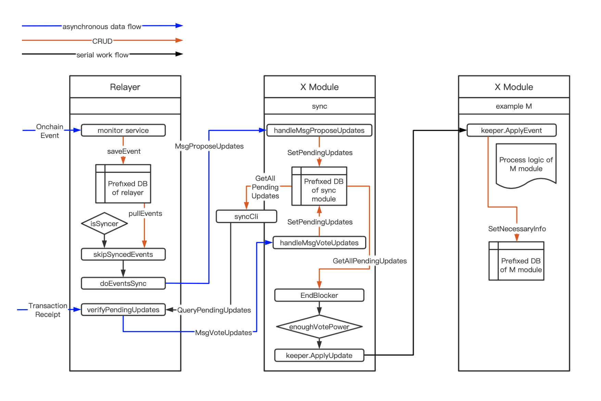
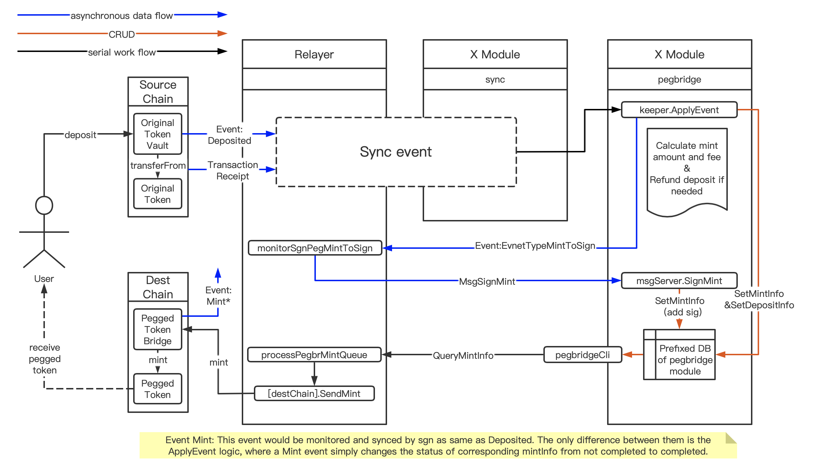

# Sync and Relay events

The main components involved are the [relayer process](../relayer/) and [x/sync consensus module](../x/sync/spec/README.md).

## Sync other chain events to SGN

- The staking module maintains a list of `syncer candidates` (a subset of bonded validators), which take the **`syncer`** role in turn.
- When the current `syncer` node catches an event, it'll broadcast msg to other sgn nodes to propose state updates triggered by the event.
- After seeing this msg, every bonded validator will do its own verification about the state and vote `yes` if agree.
- If more than 2/3 of the validator voting power have voted `yes`, the msg would be applied, which will trigger updates specific to the msg contents.

Figure below shows workflow of sync events from other blockchains to SGN.

## Send SGN data to other chains

- When a consensus module logic wants to trigger data submission to other chains, it will first emit an event to collect validator signatures.
- Each validator (relayer process) that catches the SGN event will send its signature of the data associated with the event back to the consensus module.
- Once signatures of 2/3 voting power are collected, anyone (either current `syncer` or the end user) can get the SGN data along with validator signatures and send them to the destined blockchain contract function.

Figure below use pegbridge deposit->mint flow shows the end-to-end workflow of sync deposit event from source chain and send mint transaction to the destination chain.

