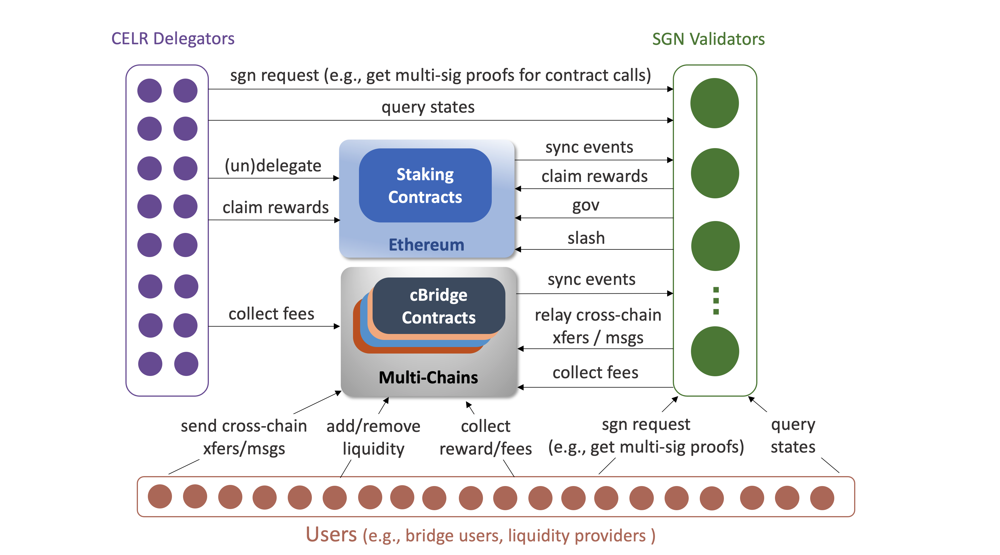

# Workflows

## Contents
- [Core Concepts](#core-concepts)
- [SGN Staking](#sgn-staking)
- [Liquidity Pool Bridge](#liquidity-pool-bridge)
- [Pegged Token Bridge](#pegged-token-bridge)

## Core Concepts

Figure above shows the overview of SGN/cBridge system. It mainly consists of five components: Ethereum staking contract, multi-chain cBridge contracts, SGN validators, CELR delegators, and cBridge users. Below we summarize the roles and responsibilities of each component:

- **Staking contracts** host the CELR staking process. They specify and enforce some fundamental rules and configurations of roles, rewards, and penalties for SGN validators and delegators.

- **Delegators** stake their CELR tokens on the staking contract to elect validators. Delegators receive shares of SGN block rewards and service fees proportional to their stakes.

- **Validators** are elected by the delegators on the staking contract. They run the SGN chain to offer cBridge services and calculate reward distributions. Validators receive commissions from their delegators.

- **cBridge contracts** include token bridge (both pool-based and peg-based) and message passing contracts that are deployed on multiple blockchains, which are used for cross-chain token transfers and message passing.

- **Users** are the SGN users. In current production systems, they include senders of cBridge cross-chain token/msg transfers or pool-based bridge liquidity providers.

Note that the figure above only depicts the high-level architecture. The actual function naming and workflow could be more complex. Sections below describe the expected behaviors of different workflows in the system.

## SGN Staking

[Spec reference of x/staking consensus module](../x/staking/spec/README.md).

Staking and validator election process happens on the Ethereum [staking contract](https://github.com/celer-network/sgn-v2-contracts/blob/a75ac8dc8b/contracts/Staking.sol). The SGN chain follows the contract events to update its states through the [event syncing](./relayer.md#sync-other-chain-events-to-sgn) process.

### New validator

1. Validator calls the [initializeValidator](https://github.com/celer-network/sgn-v2-contracts/blob/a75ac8dc8b/contracts/Staking.sol#L100) on staking contract to initialize itself as a validator, and [updateSgnAddr](https://github.com/celer-network/sgn-v2-contracts/blob/a75ac8dc8b/contracts/SGN.sol#L42) on the sgn contract to set the sgnchain (cosmos-sdk) account address.

2. The current validators catch the `ValidatorNotice` event about [sgn address update](https://github.com/celer-network/sgn-v2-contracts/blob/a75ac8dc8b/contracts/SGN.sol#L54), sync the sgn address to x/staking module and [create an sgn account](https://github.com/celer-network/sgn-v2/blob/3b35212c68/x/sync/keeper/apply.go#L72) for the new validator's sgn address.

3. The new validator then [sync its params](https://github.com/celer-network/sgn-v2/blob/3b35212c68/relayer/eth_staking.go#L54) to x/staking module to [create a new unbonded validator](https://github.com/celer-network/sgn-v2/blob/3b35212c68/x/sync/keeper/apply.go#L80) with required [initial information](https://github.com/celer-network/sgn-v2/blob/3b35212c68/relayer/operator.go#L168-L174) in the sgn chain.

4. The new validator then [sync its states](https://github.com/celer-network/sgn-v2/blob/3b35212c68/x/sync/keeper/apply.go#L129) to update its status (e.g., bonded, unbonded), tokens, and shares in the sgnchain.

5. At abci.EndBlocker, [the tendermint validator set is updated](https://github.com/celer-network/sgn-v2/blob/3b35212c68/x/staking/keeper/validator.go#L211) to include the new validator with voting power proportional to its tokens.

### Delegate and undelegate

1. Delegator calls the [delegate](https://github.com/celer-network/sgn-v2-contracts/blob/a75ac8dc8b/contracts/Staking.sol#L209) or [undelegate](https://github.com/celer-network/sgn-v2-contracts/blob/a75ac8dc8b/contracts/Staking.sol#L249) functions on the staking contract.

2. Validators catch the `DelegationUpdate` event, and [sync the delegator and validator states](https://github.com/celer-network/sgn-v2/blob/3b35212c68/relayer/eth_puller.go#L86-L98) to x/staking module.

3. [Delegation share update](https://github.com/celer-network/sgn-v2/blob/3b35212c68/x/staking/keeper/delegation.go#L104) would trigger staking reward distribution.

4. [Validator states update](https://github.com/celer-network/sgn-v2/blob/3b35212c68/x/staking/keeper/validator.go#L55) may trigger [signer updates](https://github.com/celer-network/sgn-v2/blob/3b35212c68/x/cbridge/keeper/hooks.go#L18-L28) in the bridge contracts.

## Liquidity Pool Bridge

[Spec reference of x/bridge consensus module](../x/cbridge/spec/README.md).

High-level flows and notes:
- Liquidity providers add and withdraw assets to and from the liquidity pool through [addLiquidity](https://github.com/celer-network/sgn-v2-contracts/blob/a75ac8dc8b/contracts/Pool.sol#L57) and [withdraw](https://github.com/celer-network/sgn-v2-contracts/blob/a75ac8dc8b/contracts/Pool.sol#L86) contract calls.
- User calls source chain [send](https://github.com/celer-network/sgn-v2-contracts/blob/a75ac8dc8b/contracts/Bridge.sol#L56) which transfer his own asset into source chain cBridge contract, SGN will monitor and processes the event and one SGN node will call [relay](https://github.com/celer-network/sgn-v2-contracts/blob/a75ac8dc8b/contracts/Bridge.sol#L122) on dest chain to send asset (after deducting fee) from the liquidity pool to receiver address.
- The only way assets can be removed from cBridge contract is by sending a message with enough SGN nodes’ signatures. This includes both [relay](https://github.com/celer-network/sgn-v2-contracts/blob/a75ac8dc8b/contracts/Bridge.sol#L122) and [withdraw](https://github.com/celer-network/sgn-v2-contracts/blob/a75ac8dc8b/contracts/Pool.sol#L86).

### User transfer assets across chains

1. User calls source chain cBridge contract [send](https://github.com/celer-network/sgn-v2-contracts/blob/a75ac8dc8b/contracts/Bridge.sol#L56), specify token address/amount and dest chain id, receiver address, etc.

2. SGN catches the [Send](https://github.com/celer-network/sgn-v2-contracts/blob/a75ac8dc8b/contracts/Bridge.sol#L14) event, sync the event to x/cbridge consensus module through the [event syncing](./relayer.md#sync-other-chain-events-to-sgn) flow.

3. The x/cbridge module [applies the Send event](https://github.com/celer-network/sgn-v2/blob/3b35212c68/x/cbridge/keeper/apply.go#L60).
    - If the request fail due to unsupported token, unreachable slippage etc, a withdraw message will be saved for refund later.
    - If the request can go through, the following logics will be applied before a `relay message` is generated to let all validators sign.
        - Calculation of user receiving amount, including the computation of [liquidity curve](../x/cbridge/spec/01_concepts.md#price-curve), base fee according to gas usage ad price, and percentage fee according to config.
        - Select LPs through random weighted sampling (use liquidity amount as weight) on the dest chain, move the selected LP's liquidity (user receive amount) from dest to source chain.
        - The liquidity farming (if enabled) associated with the moving liquidity will be synchronized accordingly.
        - SGN takes a cut of the percentage fee (which will be later distributed to validators and delegators). The rest of the percentage fee is distributed to the LPs proportionally to the liquidity contributed to this transfer.
        - Base fee is distributed to the current `syncer`.

4. Each validator sees the `relay message` will add its own signature and send to x/cbridge via SendMySig grpc call.

5. When it’s a validator's turn to be the `syncer`, it will periodically check if x/cbridge has a relay message that has enough signatures and call relay on dest chain.

### Liquidity provider (LP) add assets

1. Liquidity provider calls the [addLiquidity](https://github.com/celer-network/sgn-v2-contracts/blob/a75ac8dc8b/contracts/Pool.sol#L57) function to put his own assets on a chain into the system.

2. SGN catches the [LiquidityAdded](https://github.com/celer-network/sgn-v2-contracts/blob/a75ac8dc8b/contracts/Pool.sol#L34) event, sync the event to x/cbridge consensus module through the [event syncing](./relayer.md#sync-other-chain-events-to-sgn) flow.

3. The x/cbridge module [applies the LiquidityAdded event](https://github.com/celer-network/sgn-v2/blob/3b35212c68/x/cbridge/keeper/apply.go#L41), records the new liquidity, and sync the liquidity farming status (if enabled).

These liquidities will be moved around different chains (and earn fees/rewards) along with the transfer process stated above.

### User refund or LP withdrawal

The withdrawal flow is same for user transfer refund or LP liquidity withdrawal.

1. User or LP requests refund or withdrawal by sending a [withdraw request](https://github.com/celer-network/sgn-v2/blob/3b35212c68/proto/sgn/cbridge/v1/tx.proto#L68-L83) to a validator (via gateway). If x/cbridge verifies that the request is valid, it will create a withdraw message for validators to sign.
    - Note that each withdrawal request has a unique [request id](https://github.com/celer-network/sgn-v2/blob/3b35212c68/proto/sgn/cbridge/v1/tx.proto#L75), which is to make sure that each withdraw can only happen once on both SGN and the onchain smart contract.

2. SGN nodes see the withdraw msg and add its own signature, similar to the relay msg above.

3. User queries the withdraw message and validator signatures, then call the onchain [withdraw](https://github.com/celer-network/sgn-v2-contracts/blob/a75ac8dc8b/contracts/Pool.sol#L86) function.

## Pegged Token Bridge

[Spec reference of x/pegbridge consensus module](../x/pegbridge/spec/README.md).

Goal: Token T exists on chain A but not on chain B, and we would like to support a 1:1 pegged token T' on chain B.

Approach: Deploy a PeggedToken ([example](https://github.com/celer-network/sgn-v2-contracts/blob/a75ac8dc8b/contracts/pegged/tokens/MultiBridgeToken.sol)) on chain B with zero initial supply, and config SGN (through gov) to mark it as 1:1 pegged to the chain A’s original token. Anyone can lock original token T on chain A’s [OriginalTokenVault contract](https://github.com/celer-network/sgn-v2-contracts/blob/a75ac8dc8b/contracts/pegged/OriginalTokenVaultV2.sol) to trigger mint of pegged token T’ on chain B through the [PeggedTokenBridge contract](https://github.com/celer-network/sgn-v2-contracts/blob/a75ac8dc8b/contracts/pegged/PeggedTokenBridgeV2.sol) accordingly.

### Deposit original token on chain A and mint pegged token on chain B
1. User calls [deposit](https://github.com/celer-network/sgn-v2-contracts/blob/a75ac8dc8b/contracts/pegged/OriginalTokenVaultV2.sol#L65) on chain A to lock original tokens in chain A’s vault contract.

2. SGN relayers sync the [deposit event](https://github.com/celer-network/sgn-v2-contracts/blob/a75ac8dc8b/contracts/pegged/OriginalTokenVaultV2.sol#L31) to the x/pegbridge module.

3. x/pegbridge [processes the deposit event](https://github.com/celer-network/sgn-v2/blob/3b35212c68/x/pegbridge/keeper/apply.go#L30) and [generate Mint proto msg](https://github.com/celer-network/sgn-v2/blob/3b35212c68/x/pegbridge/keeper/apply.go#L251-L275) for validators to sign.

4. SGN syncer call [mint](https://github.com/celer-network/sgn-v2-contracts/blob/a75ac8dc8b/contracts/pegged/PeggedTokenBridgeV2.sol#L57) function on chain B with the signed Mint proto msg. User receives the newly minted pegged tokens.

5. SGN catch the [mint event](https://github.com/celer-network/sgn-v2-contracts/blob/a75ac8dc8b/contracts/pegged/PeggedTokenBridgeV2.sol#L24), sync it to x/pegbridge to [mark the process is done](https://github.com/celer-network/sgn-v2/blob/3b35212c68/x/pegbridge/keeper/apply.go#L156-L157).

### Burn pegged token on chain B and withdraw original token on chain A
1. User calls [burn](https://github.com/celer-network/sgn-v2-contracts/blob/a75ac8dc8b/contracts/pegged/PeggedTokenBridgeV2.sol#L109) on chain B to burn the pegged token.

2. SGN relayers sync the [burn event](https://github.com/celer-network/sgn-v2-contracts/blob/a75ac8dc8b/contracts/pegged/PeggedTokenBridgeV2.sol#L33) to the x/pegbridge module

3. x/pegbridge [processes the burn event](https://github.com/celer-network/sgn-v2/blob/3b35212c68/x/pegbridge/keeper/apply.go#L84) and [generate Withdraw proto msg](https://github.com/celer-network/sgn-v2/blob/3b35212c68/x/pegbridge/keeper/apply.go#L123-L125) for validators to sign.

4. SGN syncer call [withdraw](https://github.com/celer-network/sgn-v2-contracts/blob/a75ac8dc8b/contracts/pegged/OriginalTokenVaultV2.sol#L135) function on chain A with the signed Withdraw proto msg

5. SGN catches the [withdraw event](https://github.com/celer-network/sgn-v2-contracts/blob/a75ac8dc8b/contracts/pegged/OriginalTokenVaultV2.sol#L40), sync it to x/pegbridge to [mark the process is done](https://github.com/celer-network/sgn-v2/blob/3b35212c68/x/pegbridge/keeper/apply.go#L173-L174).

### Burn pegged token on chain B and mint pegged token on chain C
1. User calls [burn](https://github.com/celer-network/sgn-v2-contracts/blob/a75ac8dc8b/contracts/pegged/PeggedTokenBridgeV2.sol#L109) on chain B to burn the pegged token, specifying chain C's chainId as `toChainId`

2. SGN relayers sync the [burn event](https://github.com/celer-network/sgn-v2-contracts/blob/a75ac8dc8b/contracts/pegged/PeggedTokenBridgeV2.sol#L33) to the x/pegbridge module

3. x/pegbridge [processes the burn event](https://github.com/celer-network/sgn-v2/blob/3b35212c68/x/pegbridge/keeper/apply.go#L84) and [generate mint proto msg](https://github.com/celer-network/sgn-v2/blob/3b35212c68/x/pegbridge/keeper/apply.go#L126-L128) for validators to sign.

4. SGN syncer call [mint](https://github.com/celer-network/sgn-v2-contracts/blob/a75ac8dc8b/contracts/pegged/PeggedTokenBridgeV2.sol#L57) function on chain C with the signed Mint proto msg. User receives the newly minted pegged tokens.

5. SGN catches the [mint event](https://github.com/celer-network/sgn-v2-contracts/blob/a75ac8dc8b/contracts/pegged/PeggedTokenBridgeV2.sol#L24), sync it to x/pegbridge to [mark the process is done](https://github.com/celer-network/sgn-v2/blob/3b35212c68/x/pegbridge/keeper/apply.go#L156-L157).

### SGN delegators claim fee shares on chain A
1. Delegator requests withdrawal of fee shares via gateway.

2. SGN validates the request and [generates co-signed Withdraw proto msg](https://github.com/celer-network/sgn-v2/blob/3b35212c68/x/pegbridge/keeper/msg_server.go#L193-L218).

3. Delegator get the Withdraw proto msg from gateway and call [withdraw](https://github.com/celer-network/sgn-v2-contracts/blob/a75ac8dc8b/contracts/pegged/OriginalTokenVaultV2.sol#L135) function on chain A with it.