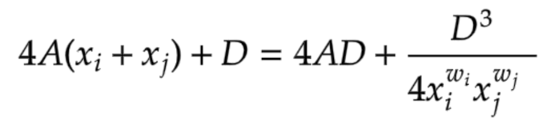

# Concepts
## Liquidity Provider (LP)
In cBridge V2, our smart contract will lock assets from liquidity providers. They put their own assets into the system to earn reward and fee. Add assets to cbridge contract is done by calling addLiquidity onchain. If someone wants to add liquidity on different chains, he needs to switch metamask network and do it separately.

Each LP's liquidity is tracked per chain and token address. When liquidity is used by transfer, it is moved from dest chain to src chain. On dest chain, a LP’s liquidity minus his portion in the transfer, then plus earned fee, on source chain, his liquidity will add (user’s token amount on source chain * portion percentage on dest chain). Note it’s possible due to rounding, the sum of all added liquidity is less than user token

## Price Curve
Specifically, for any pair of chains i and j, let xi and xj be the balance on chain i and chain j for a given token, respectively. Then the following invariant should always hold when we calculate the slippage of token transfers between chain i and chain j:

- A is a per-chain-pair constant to be configured (note that chain pair does not distinguish the order of the chains). For the same chain pair, A is the same for all tokens.
- D is a variable. The initial D can be obtained by solving a cubic equation against D given the initial liquidity on the two chains. After that, D should be updated when (1) LP add liquidity to any of the two chains (2) LP remove liquidity from any of the two chains (3) there is a transfer from other chains (different from chain i and chain j) to any of the two chains, and (4) there is a transfer from any of the two chains to other chains (different from chain i and chain j).  Each time we need to update D, we should solve a cubic equation for D given the current new balances xi and xj.
- wi and wj are the relative weights for the two chains, which is used to control the slippage asymmetry for the transfers of different directions between the two chains. Note that the configuration of weights is per-chain-pair and should satisfy wi+wj=2. For the same chain pair, the weights are the same for all tokens. For example, below is the curve for D=10, A=20, wi=0.5, wj=1.5 (blue curve is the constant sum curve xi+xj=10 for reference). We can see the curve penalize more for transfers from chain i to chain j when the imbalance happens. If wi=1, wj=1, it recovers the Curve invariant.

## LP Selection
There 2 conflicting goals: fairness and scalability. Our current algorithm is to select up to n LPs and radom sample by their liquidity. When choose one LP, we try to use all liquidity this LP has.